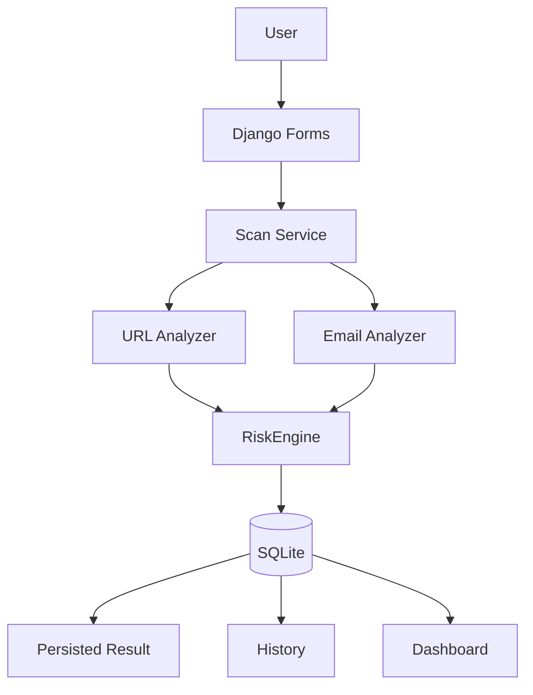
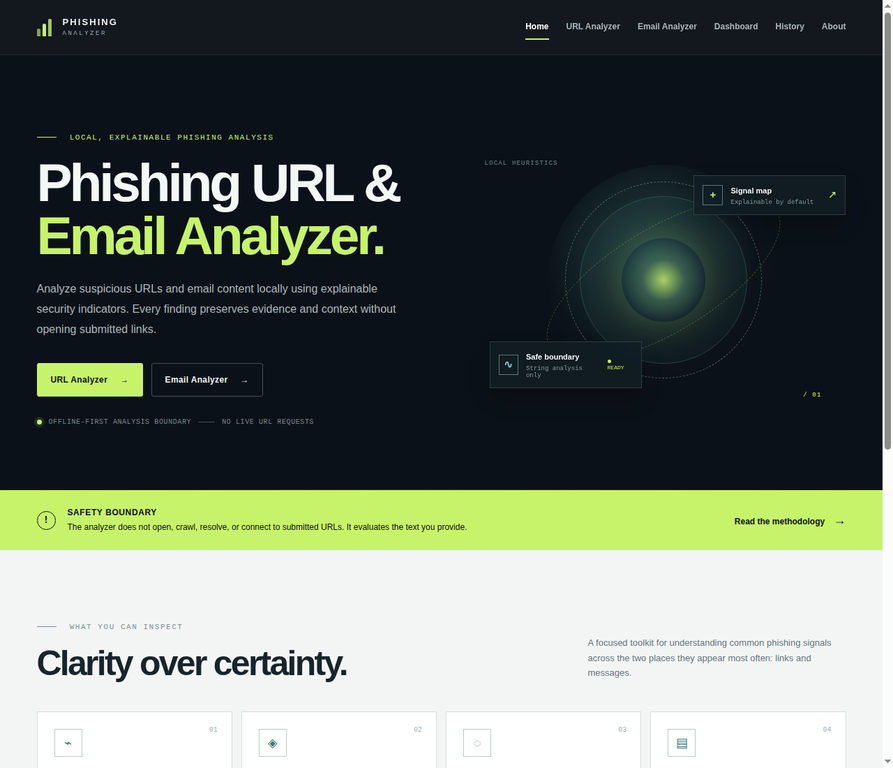
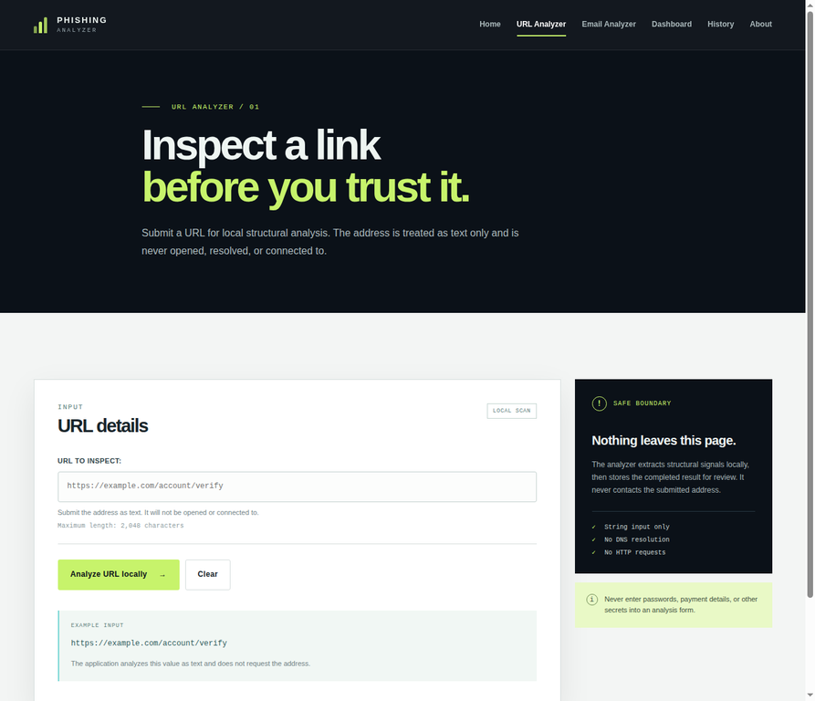
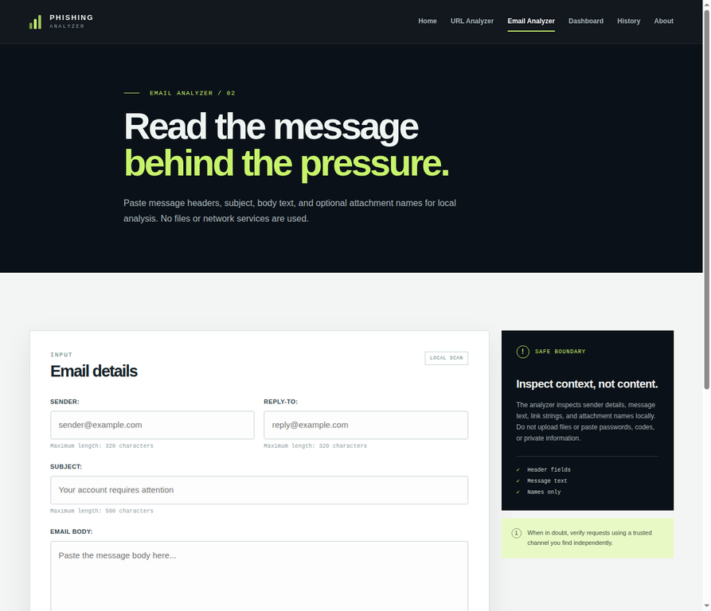
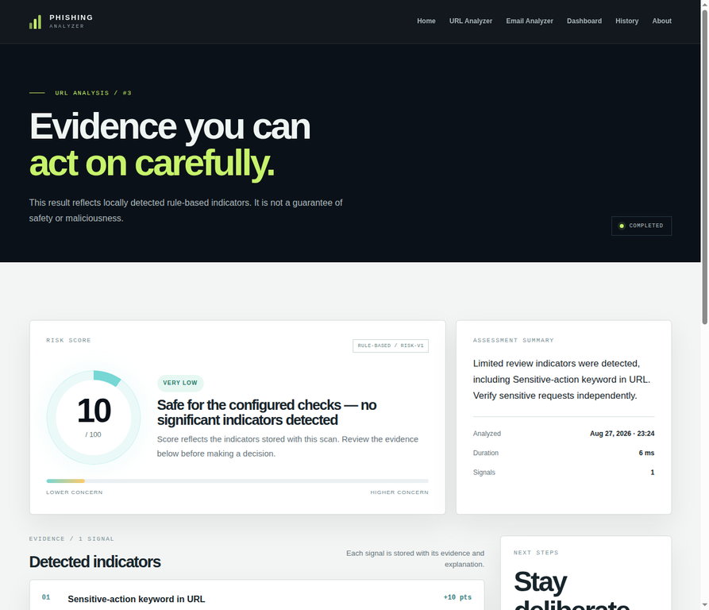
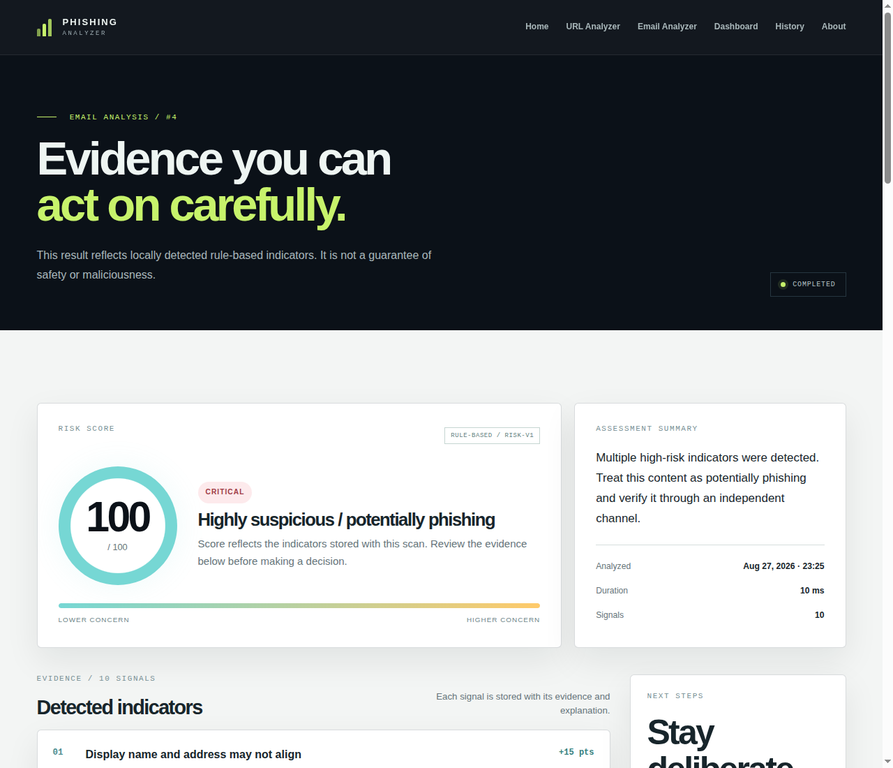
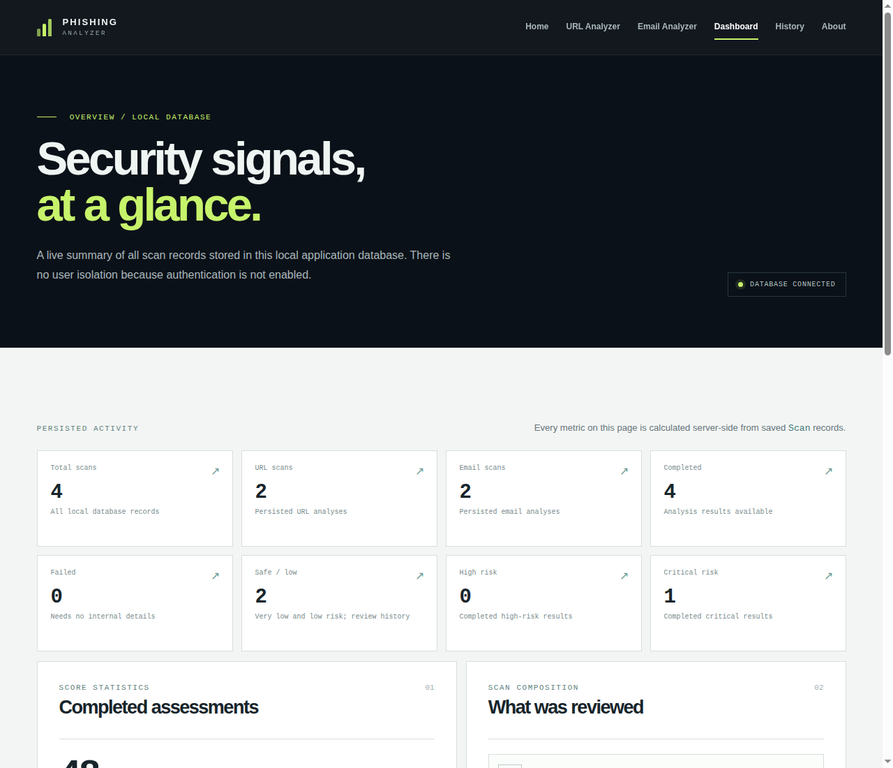
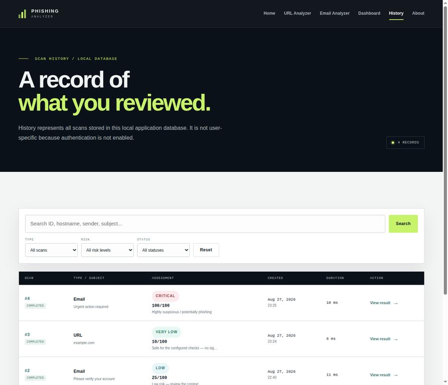

# Phishing URL & Email Analyzer

> Local, explainable phishing indicator analysis for URLs and email text.
>
> [](https://www.python.org/) [](https://www.djangoproject.com/) [](docs/security.md) [](docs/testing.md)

Phishing URL & Email Analyzer is a university and portfolio-ready Django application for reviewing suspicious links and message context without opening submitted URLs. It uses deterministic local heuristics to surface evidence, explain why each signal matters, and produce a bounded risk score that a person can review rather than blindly trust.

> **Current status — Phase 9:** The application includes the complete local scan workflow, persisted results, real history and dashboard views, security hardening, adversarial regression coverage, responsive product UI, local branding, screenshot documentation, and portfolio-ready architecture notes. Authentication and user-specific isolation are intentionally not enabled.

## Overview

The project focuses on careful analysis at the moment before a user clicks a link or follows an urgent request. URL submissions are treated as strings. Email submissions are analyzed from structured header fields, subject, body text, extracted URL strings, and attachment names. The application never opens, crawls, resolves, or requests a submitted URL.

The result is an explainable report containing a persisted score from 0–100, a named risk level, a cautious verdict, detected indicators, evidence, explanations, recommendations, and technical metadata. Historical results can be reviewed through the all-database History page and server-derived Dashboard.

## Key Features

- **URL analysis:** structural inspection of schemes, hostnames, IP-like values, ports, length, depth, encoding, suspicious keywords, shorteners, punycode, and other local indicators.
- **Email analysis:** sender and Reply-To context, subject and body language, urgency and social-engineering indicators, suspicious links, HTML visible-link mismatches, and risky attachment names.
- **Explainable scoring:** a centralized `RiskEngine` maps evidence to a bounded 0–100 score and five risk bands: Very Low, Low, Medium, High, and Critical.
- **Persisted result reports:** completed results retain the evidence and recommendations used to produce them; result pages do not rerun analysis.
- **History and Dashboard:** read-only GET views with filtering, bounded search, pagination, risk distribution, type composition, score statistics, and recent activity calculated from real SQLite records.
- **Local-first interface:** responsive server-rendered HTML, CSS, and minimal vanilla JavaScript with no external fonts, icon CDN, animation library, or client-side scoring.
- **Security-aware defaults:** CSRF-protected forms, bounded inputs, ORM-based queries, safe failure states, security headers, escaped output, transaction rollback coverage, and adversarial tests.

## How It Works



The view layer validates a submission and delegates orchestration to the scan service. The service runs the appropriate framework-independent analyzer, passes its structured indicators to the centralized RiskEngine, and persists the completed result transactionally. Email URLs reuse the URL analyzer locally rather than duplicating URL rules. Result, History, and Dashboard pages read persisted records only.

## URL Analysis

The URL analyzer accepts a URL string and returns a framework-independent structured result. It uses standard-library parsing and local string inspection only. The analyzer does not perform DNS resolution, HTTP or HTTPS requests, redirect following, crawling, reputation lookup, or external API calls.

Signals include protocol and authority shape, IP-address usage, hostname and URL length, subdomain depth, suspicious top-level domains, keywords, `@` notation, unusual ports, URL shorteners, percent encoding, suspicious punctuation, path depth, domain structure, and punycode or IDN indicators. Each finding has a stable code, severity, points, evidence, explanation, and recommendation.

## Email Analysis

The email analyzer accepts structured sender, Reply-To, subject, body, and attachment-name text. It can also parse bounded MIME content through the standard library for the internal analysis contract. HTML parts are handled as inert text, and only visible text and link attributes are considered. Attachment names are metadata only; binary files are not uploaded, opened, unpacked, scanned, or executed.

Email indicators cover urgency, threats, account suspension language, credential and password requests, OTP or verification requests, financial pressure, sender anomalies, Reply-To mismatches, suspicious links, URL structure, HTML link-text mismatches, and executable-looking attachment names. Extracted URL strings are analyzed by the same local URL analyzer.

## Explainable Risk Engine

The `RiskEngine` is framework-independent and consumes structured indicators from the analyzers. It deduplicates repeated codes, handles nested email URL evidence without double-counting, applies the centralized `risk-v1` weights, clamps the result to 0–100, maps it to the five risk bands, and produces a transparent breakdown, summary, verdict, and recommendations.

The score is a decision-support signal, not a claim that a message or URL is safe or malicious. The persisted score and risk level are displayed directly by the result interface; no score is calculated in browser JavaScript.

| Score | Risk |
| --- | --- |
| 0–19 | Very Low |
| 20–39 | Low |
| 40–59 | Medium |
| 60–79 | High |
| 80–100 | Critical |

## Dashboard & History

Dashboard statistics are calculated server-side from persisted `Scan` records using bounded Django ORM aggregates and a grouped risk query. The Dashboard includes total, URL, email, completed, failed, Safe / low, High, and Critical counts; completed-score average, highest, and lowest values; risk distribution; scan composition; recent activity; and the all-database limitation notice.

History is a read-only view with GET filters for type, risk, and status, bounded search over safe metadata fields, stable result links, safe failed-scan presentation, and 15-record pagination with filter preservation. It does not search or display raw email bodies, and neither History nor Dashboard reruns an analyzer or creates a record.

## Security & Privacy

The local/offline boundary is deliberate:

- Submitted URLs are never opened, resolved, crawled, redirected, or contacted.
- The application performs no DNS lookup, live HTTP/HTTPS request, reputation check, or external API call.
- Binary attachments are not accepted; attachment names are text-only metadata.
- Server-rendered output remains escaped, and no unsafe template filter or dynamic HTML injection is used.
- POST analyzer forms require Django CSRF protection.
- History search and filters use bounded Django ORM expressions rather than raw SQL.
- Inputs, MIME content, nested URLs, attachment names, indicators, and persisted evidence are bounded.
- Failures expose a generic safe state rather than internal exception text.
- The UI uses local static assets and system font fallbacks only.

This application has **no authentication, accounts, authorization, or user isolation**. History and Dashboard show every scan stored in the local SQLite database. Do not paste passwords, one-time codes, payment data, or private message content into a local demonstration unless you understand the retention implications.

## Architecture

This is a small Django monolith with four logical components:

| Component | Responsibility |
|---|---|
| `core` | Home and About pages, product positioning, and methodology copy |
| `scans` | Forms, persistence models, services, scan routes, result pages, History, and admin registration |
| `analysis` | Pure-Python URL analyzer, email analyzer, shared text helpers, contracts, constants, and RiskEngine |
| `dashboard` | Database-backed aggregate statistics and recent activity presentation |

The application intentionally keeps analyzers independent from Django models. The service boundary is the only orchestration point between form input, analysis, scoring, and transactional persistence.

## Technology Stack

| Layer | Technology |
|---|---|
| Language | Python |
| Web framework | Django 5.2 |
| Persistence | Django ORM with SQLite |
| UI | Django templates, HTML5, CSS3, minimal vanilla JavaScript |
| Runtime dependencies | Django only |
| Analysis boundary | Standard-library parsing and deterministic local rules |
| Background infrastructure | None |

## Installation

```bash
python3 -m venv .venv
source .venv/bin/activate
pip install -r requirements.txt
```

The dependency file contains Django only. Copy `.env.example` to `.env` only when local environment values need to be managed separately; the project does not require a dotenv package.

## Running Locally

From the project root:

```bash
python manage.py check
python manage.py migrate
python manage.py runserver
```

Open [http://127.0.0.1:8000/](http://127.0.0.1:8000/) in a browser. The SQLite database is stored under `data/` for local development and is ignored by Git.

## Testing

Run the complete suite with:

```bash
python manage.py test -v 1
```

The verified baseline contains **187 passing tests** across model constraints, analyzer behavior, RiskEngine scoring, transactional workflow, persisted result rendering, History and Dashboard read models, adversarial inputs, CSRF, XSS, SQL-injection-shaped searches, resource bounds, runtime network blocking, safe failures, security headers, and browser-facing view behavior. Phase 9 changes are UI, documentation, screenshot, and local asset polish only; analyzer logic, RiskEngine behavior, scan services, and database models remain unchanged.

## Example Workflow

1. Open the URL Analyzer and submit a fictional value such as `https://example.com/account/verify`.
2. Review the persisted score, risk band, evidence, explanation, technical details, and limitation notice.
3. Open the Email Analyzer and enter sender context, a subject, message text, suspicious link strings, or attachment names as text.
4. Follow the existing result route, then open History to see the real saved record.
5. Open Dashboard to review database-derived counts and risk distribution.
6. Use the About page to review the methodology and limitations before interpreting a result.

## Screenshots

Representative local screenshots are maintained under [`docs/screenshots/`](docs/screenshots/) for portfolio documentation. They were captured from the local browser workflow using genuine local records and contain no credentials, private message content, external-service data, or permanent fake records.

### Home & Analysis

| Home — product overview and analyzer entry points | URL Analyzer — local URL inspection interface |
|---|---|
|  |  |

### Email Analysis

| Email Analyzer — structured email inspection interface |
|---|
|  |

### Analysis Results

| URL Result — explainable score, indicators, evidence, and recommendations | Email Result — structured email security findings |
|---|---|
|  |  |

### Monitoring & History

| Dashboard — aggregated scan statistics and risk distribution | History — searchable and filterable persisted scan records |
|---|---|
|  |  |

## Limitations

This is an educational analysis aid, not a guarantee of safety or maliciousness. Local heuristics can produce false positives and false negatives. The current system cannot verify live reputation, ownership, reachability, sender authenticity, malware behavior, or actual user intent. It does not use live network intelligence, DNS, crawling, machine learning, binary attachment analysis, or external services.

Authentication, user-specific history, and user isolation are not implemented. Stored records are local application data and are visible through the all-database History and Dashboard views.

## Project Structure

```text
config/       Django settings and root routing
core/         Home and About pages
scans/        Forms, models, services, routes, results, history, and tests
analysis/     Pure-Python analyzers, RiskEngine, contracts, and tests
dashboard/    Database-backed dashboard view and tests
templates/    Server-rendered HTML templates
static/       Local CSS, JavaScript, and favicon
docs/         Architecture, security, testing, and browser QA notes
data/         Local SQLite database location
```

## Future Improvements

Possible future work includes richer accessibility testing, optional `.eml` workflow improvements, and—only after an explicit scope change—authentication, user-specific history, external threat intelligence, or a separate quarantine architecture for binary uploads. Those capabilities are not part of the current application.
